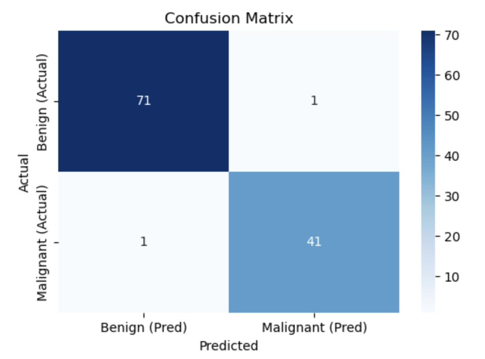

## 📌 Overview
Breast cancer is one of the most common cancers worldwide, and early detection plays a crucial role in improving patient outcomes. Medical diagnosis often relies on examining **biopsy samples** to determine whether a tumor is **benign** (non-cancerous) or **malignant** (cancerous). Among biopsy techniques, **fine needle aspirate (FNA)** is widely used because it is minimally invasive and effective at capturing cellular details for diagnosis. This dataset consists of **569 patient cases** with **30 numerical features** extracted from digitized images of FNA samples of breast tissue. 

These features capture properties such as **radius, texture, perimeter, area, smoothness, compactness, concavity, symmetry, and fractal dimension**. For each feature, measurements of the **mean**, **standard error**, and **worst (largest value)** are recorded, resulting in a comprehensive set of predictors. Each case is labeled as:
- **Benign (B):**
    - Non-cancerous
    - Encapsulated
    - Slow-growing
    - Non-invasive
    - Cells appear structurally normal.
      
- **Malignant (M):**
    - Cancerous
    - Non-capsulated
    - Fast-growing
    - Invasive with abnormal cell morphology (e.g., large dark nuclei)
    - Capable of metastasis.  

## 🎯 Project Objective
The objective of this project was to apply **machine learning** to predict whether a breast tumor is malignant or benign, based on the features extracted from FNA images. Several models were compared, with a focus on achieving not only high accuracy but also **strong recall for malignant cases**, since false negatives (failing to detect cancer) carry far greater risk than false positives. By evaluating and comparing models such as Logistic Regression and Random Forest, the project aims to demonstrate how data-driven approaches can support **early detection** and assist in medical decision-making.

## ✨ Results
Two models were compared in this project: **Logistic Regression (LR)** and **Random Forest Classifier (RFC)**. Both achieved strong performance, but key differences emerged when looking deeper into their generalization and recall on malignant cases.

| Metric                  | Logistic Regression | Random Forest |
|--------------------------|---------------------|---------------|
| Train Accuracy           | 98.46%              | **99.78%**        |
| Test Accuracy            | **98.25%**              | 97.37%        |
| Precision (Class 0 - Benign) | **0.99**           | 0.96          |
| Recall (Class 0 - Benign)    | 0.99           | **1.00**          |
| Precision (Class 1 - Malignant) | 0.98        | **1.00**          |
| Recall (Class 1 - Malignant)    | **0.98**        | 0.93          |
| Best Cross-Validation Score     | **97.36%**      | 97.14%        |

**Confusion Matrix Diagram:**

### 📊 Key Insights
- **Generalization**: Logistic Regression shows consistent train vs. test accuracy (98.46% vs. 98.25%), whereas Random Forest has higher train accuracy but drops more on the test set (99.78% → 97.37%), suggesting mild **overfitting**.  
- **Malignant Recall**: Logistic Regression achieves a recall of **0.98**, meaning it correctly identifies 98% of malignant tumors. Random Forest drops to **0.93**, which is less reliable in a medical setting where missing a malignant tumor is high-risk.  
- **Precision Tradeoff**: Random Forest has perfect precision for malignant tumors (**1.00**), but this comes at the expense of recall, leading to more false negatives. Logistic Regression balances precision (**0.98**) and recall (**0.98**) more effectively.  
- **Cross-Validation**: Both models perform consistently during cross-validation, with Logistic Regression slightly ahead (**97.36% vs. 97.14%**).  

### 🏆 Final Model Selection
👉 **Logistic Regression was chosen as the final model** because it:  
- Generalizes better to unseen data.  
- Achieves higher recall on malignant tumors (critical in healthcare).  
- Maintains high precision while minimizing the risk of false negatives.  
- Is interpretable, making it suitable for clinical applications.  
